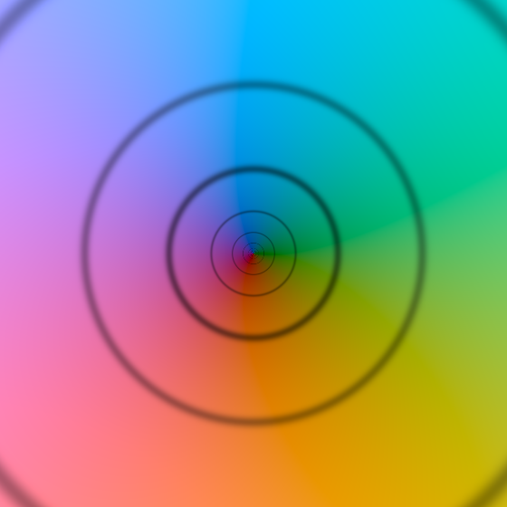
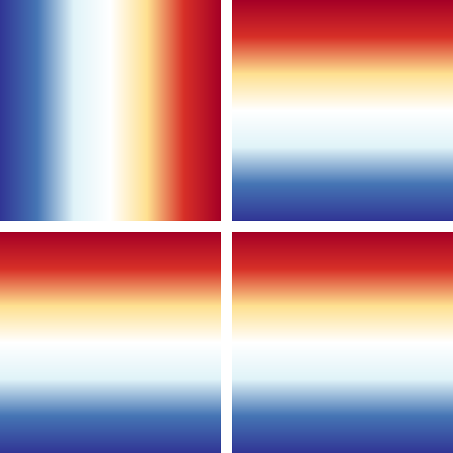
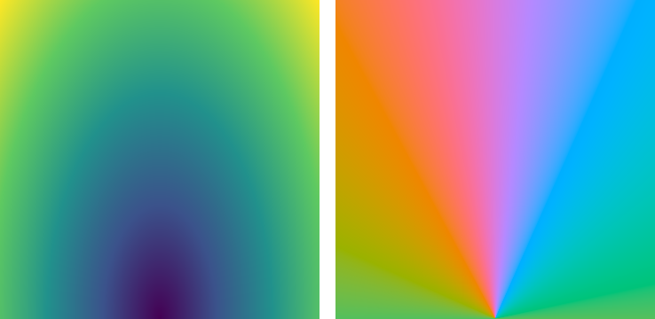
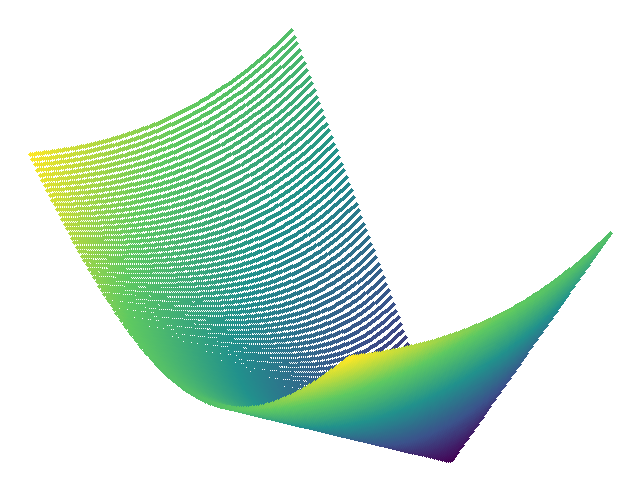
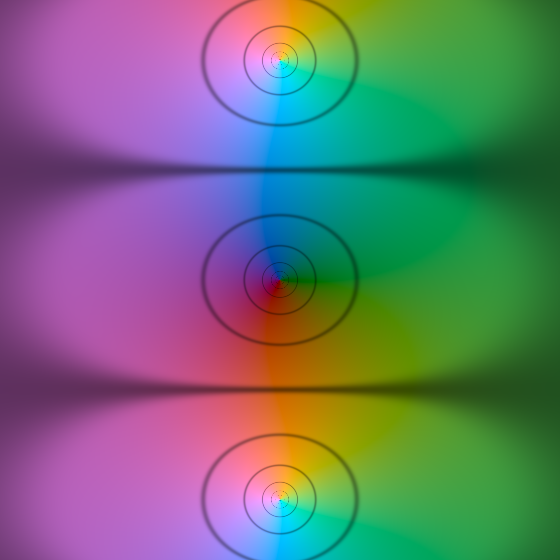
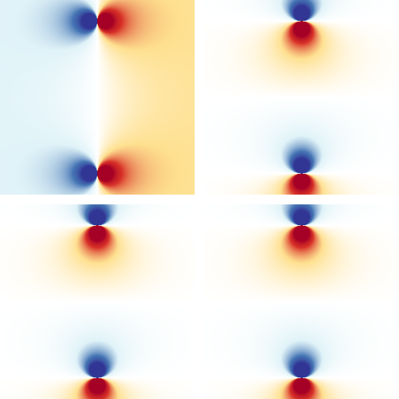
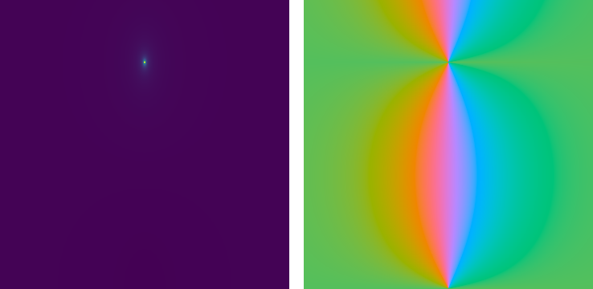
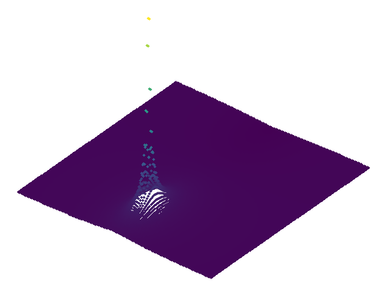

# hviz

`hviz` plots quaternion-valued functions, especially quaternion activation
functions, using HoloViews. The base 2D plots use the Bokeh backend. True 3D
surfaces use HoloViews' Plotly backend because Bokeh does not provide the
corresponding 3D surface element.

Quaternions are represented as NumPy arrays whose final axis stores
`[r, i, j, k]`.

```python
import hviz


def identity(q):
    return q


plot = hviz.plot_slice(
    identity,
    (-3.0, 3.0, 400),
    (-3.0, 3.0, 400),
    title="q",
)

hviz.save(plot, "identity_slice.html")
```

## Plotting Solutions

- `hviz.plot_slice(function, x_range, y_range)` samples a quaternion slice
  `q = x + y * axis` and returns a Bokeh-backed `holoviews.RGB` object. This is
  the closest equivalent to `cviz.plot`.
- `hviz.plot_components(function, ...)` returns a four-panel Bokeh layout for
  `Re(f(q))`, `i(f(q))`, `j(f(q))`, and `k(f(q))`.
- `hviz.plot_magnitude_phase(function, real_range, imag_norm_range)` follows the
  quaternion-activation visualization used by Poeppelbaum and Schwung: input is
  reduced to `Re(q)` and `||Im(q)||`, then output magnitude and phase are shown
  as 2D Bokeh panels.
- `hviz.plot_surface(function, real_range, imag_norm_range)` returns a
  Plotly-backed HoloViews 3D surface for `||f(q)||`.

The `Re(q)`/`||Im(q)||` view is not a full four-dimensional plot. It is a
deliberate diagnostic slice. The imaginary direction defaults to
`(i + j + k) / sqrt(3)` and can be changed with `imag_axis`.

## Example Gallery

Generated with:

```console
python examples/gallery.py
```

### Identity: `q`

#### Slice Domain Coloring



Hue is output phase on the selected slice; brightness and rings show output norm.

#### Component Panels



Each panel is one output component; blue is negative, white is zero, red is positive.

#### Magnitude And Phase



Left shows output norm. Right shows phase using real input versus imaginary-input norm.

#### 3D Magnitude Surface



Height is output norm over the same real-input and imaginary-input-norm grid.

### Quaternion tanh: `tanh(q)`

#### Slice Domain Coloring



Hue changes with output phase; brighter regions have larger output norm.

#### Component Panels



Shows which quaternion components are amplified, damped, or sign-flipped.

#### Magnitude And Phase



Left shows saturation and poles in norm. Right shows how phase bends.

#### 3D Magnitude Surface



Peaks mark large output-norm values on the reduced quaternion grid.

## Quaternion Activation Examples

The API accepts any vectorized function that takes and returns arrays with a
final quaternion component axis.

```python
import numpy as np
import hviz


def split_relu(q):
    return np.maximum(q, 0.0)


def quaternion_cardioid(q):
    radius = hviz.quaternion_norm(q)
    scale = np.divide(q[..., 0], radius, out=np.zeros_like(radius), where=radius > 0.0)
    return 0.5 * (1.0 + scale)[..., None] * q


hviz.plot_slice(hviz.quaternion_tanh, (-2.0, 2.0, 400), (-2.0, 2.0, 400))
hviz.plot_slice(split_relu, (-3.0, 3.0, 400), (-3.0, 3.0, 400))
hviz.plot_magnitude_phase(quaternion_cardioid, (-3.0, 3.0, 240), (0.0, 3.0, 240))
hviz.plot_surface(quaternion_cardioid, (-3.0, 3.0, 120), (0.0, 3.0, 120))
```

## Install For Development

```console
python -m pip install -e ".[dev]"
pytest
```
